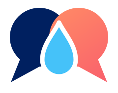
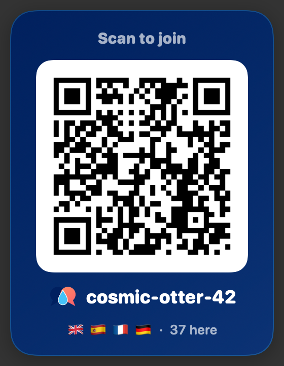
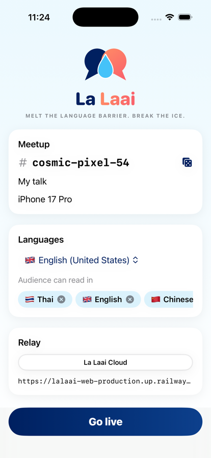

<p align="center">
  
</p>

<h1 align="center">La Laai</h1>
<p align="center"><b>Melt the language barrier. Break the ice.</b></p>
<p align="center">Live on-device captions, translated Q&amp;A and icebreakers that make locals and visitors actually talk to each other.</p>

---

## Why

**Chiang Mai has a huge meetup community.** Tech talks, startup nights, co-working socials, language exchanges, workshops. Almost every night, and almost all of it in English.

**But there's a group that often gets left out: local Thai people.** The people who live here, know the city, and have the most to share are the least likely to be in the room.

**The problem isn't just understanding.** There are three barriers, and each is harder than the last:

1. **Following the talk.** A fast talk in a second language is hard to keep up with.
2. **Asking a question.** Even when you follow, speaking up in English in front of a room is intimidating.
3. **Approaching someone.** Walking up to a stranger afterwards is harder still.

Most translation tools only touch the first one.

### Money flows in. Knowledge should too.

Today, many nomads and visitors come to Chiang Mai, spend money, and move on. That helps for a season, but what they know leaves with them. The long-term win is **knowledge exchange**: skills, networks and ideas flowing both ways, in both languages, and staying in the city after the visitors go. La Laai turns *passing through* into *passing on*.

## So we built La Laai

In Thai, **ละลาย (la‑laai) means *to melt*.** La Laai melts the barriers that stop people joining the conversation. Our mascot, Laai, is a drop of melted ice whose hands are two speech bubbles: one navy, one warm. Two people, two languages.

| Barrier | What La Laai does |
|---|---|
| **1. Understanding** | The speaker's Mac or iPhone transcribes and translates **on-device**. Captions stream to every phone in the viewer's language, with the original one tap away. There are two modes: **Live** (only the current sentence) and **Additive** (a continuous transcript). |
| **2. Asking** | Ask in Thai, and the speaker reads it in English. Everyone else sees it in their own language. You can ask **anonymously**. The room likes the best questions up, and the speaker pins one on screen with a click. |
| **3. Approaching** | **Meet the people who liked your question.** Wave, they accept, and you're matched. Only then do you see each other's name, *how to spot them* ("red hat with stripes") and contact. Each person gets **icebreakers in their own language**, grounded in the talk. |

**For attendees it's one QR code and no app to install:** scan, pick your language, read along, ask, meet.

<p align="center">
  
  &nbsp;
  
</p>

## How it works

```
┌────────── Presenter: Mac app (or iPhone app) ──────────┐
│ mic → speech recognition (Apple, on-device)             │
│     → translation (Apple Translation, on-device;        │
│       NLLB-200 on-device for languages Apple lacks)     │
│ floating QR · Q&A · captions over fullscreen slides     │
│ MCP server ◀── your Claude Code / Codex / Gemini CLI    │
└──────────────────────────┬──────────────────────────────┘
                 WebSocket │ captions, translations, moderation, icebreakers
                           ▼
        ┌──────── Relay (the only deployed part) ────────┐
        │ rooms · per-language fan-out · Q&A · likes ·   │
        │ anonymous questions · meet matching · PWA host │
        └────────────────────────┬───────────────────────┘
                       WebSocket │ each phone gets only its language
                                 ▼
             Attendee phones (web app from the QR code)
```

**Icebreakers that know the talk.** When two people match, the presenter's Mac runs *their own* AI CLI (Claude Code, Codex, Gemini or a custom command) headless, with La Laai's local MCP server attached. The agent reads the slides, the live transcript and the question that connected the pair (tools: `get_icebreaker_job`, `get_presentation`, `get_transcript`, `get_questions`, `submit_icebreakers`). It then submits icebreakers, delivered to each person in their own language. The organiser needs no API keys. Without an AI, attendees still get friendly localized templates.

**Built for free community events.**
- **A laptop is all an organiser needs.** No interpreter and no special hardware.
- **Speech and translation run on-device.** Audio never leaves the room.
- **Attendees install nothing.** A QR code and a phone browser.
- **Your AI writes the icebreakers**, using the subscription you already have.

## Repository layout: what's deployed vs. what's app source

```
web/                ← DEPLOYED. The only thing that runs on a server (Railway / any Docker host)
  relay/            Bun WebSocket relay: rooms, fan-out, Q&A, anonymity, meet matching (+ tests)
  pwa/              Attendee web app (Vite + Preact), built into web/pwa/dist and served by the relay
  shared/           protocol.ts: the wire contract, the single source of truth
  Dockerfile        relay + built PWA in one image (build context: web/)

apps/               ← NATIVE APP SOURCE. Never deployed; distributed as signed apps
  macos/            Presenter app for macOS 26 (SwiftPM). build-app.sh, notarize.sh
  ios/              Presenter app for iPhone/iPad, iOS 26 (Xcode project LaLaai.xcodeproj)
  shared/           Swift shared by both apps: protocol mirror, relay client, speech engine, translator, brand
  translator/       On-device NLLB-200 helper (Python/uv), bundled into the Mac app

scripts/            End-to-end tests that drive the real Mac app headless
docs/               Images for this README
```

Rule of thumb: **anything under `web/` goes to the server; anything under `apps/` goes to a presenter's device.** The two sides talk only through the protocol in [`web/shared/protocol.ts`](web/shared/protocol.ts), mirrored in [`apps/shared/Protocol.swift`](apps/shared/Protocol.swift).

## Download

**Mac presenter app** (macOS 26, Apple Silicon; signed and notarized):
[**La Laai.dmg**](https://github.com/Martin-Atrin/lalaai/releases/latest/download/LaLaai.dmg) ·
[.zip](https://github.com/Martin-Atrin/lalaai/releases/latest/download/LaLaai.zip) ·
[all releases](https://github.com/Martin-Atrin/lalaai/releases)

Attendees need nothing: they scan the QR code.

## Getting started

### Relay + attendee web app (deploy)

```bash
pnpm -C web/pwa install && pnpm -C web/pwa build
```
```bash
bun web/relay/src/server.ts
```

That runs on `:8787`, and phones on the same Wi‑Fi can join. For real events, deploy `web/` behind HTTPS. With Railway, run `railway up` from `web/`: the Dockerfile there builds the PWA and runs the relay. Set `PUBLIC_URL` if you use a custom domain.

### Mac presenter app

Requires macOS 26 on Apple Silicon.

```bash
apps/macos/build-app.sh && open apps/macos/build/lalaai.app
```

1. Choose your language, audience languages and relay (**La Laai Cloud** or **This Mac**), then **Go live**.
2. The QR, Q&A and caption windows float above fullscreen Keynote, PowerPoint or Google Slides. Hover a window for its style (Glass / Solid / Clear with outlined text), caption mode and size controls, or drag its corner to resize.
3. Global shortcuts work from any app:

| Shortcut | Action |
|---|---|
| ⌃⌥⌘M | Pause or resume the mic |
| ⌃⌥⌘Q | Show or hide the QR code |
| ⌃⌥⌘A | Show or hide Q&A |
| ⌃⌥⌘C | Show or hide captions |

To distribute a signed, notarized build:

```bash
xcrun notarytool store-credentials "lalaai-notary" --apple-id <you@example.com> --team-id <TEAMID>
```
```bash
SIGN_IDENTITY="Developer ID Application: <Name> (<TEAMID>)" apps/macos/build-app.sh && apps/macos/notarize.sh
```
```bash
SIGN_IDENTITY="Developer ID Application: <Name> (<TEAMID>)" apps/macos/make-dmg.sh
```

### iPhone presenter app

Open `apps/ios/LaLaai.xcodeproj` in Xcode 26, pick your team, and run it on a device. It has the same pipeline as the Mac (on-device speech and Apple translation), plus:
- a full-screen QR code to hold up;
- Live and Additive captions;
- swipe-to-moderate Q&A;
- the screen stays awake while you're live.

It's made for talks without a laptop: yoga classes, walking tours, monk trails. AI icebreakers and NLLB are Mac-only for now, so iPhone rooms use the localized template icebreakers.

## Languages

- **Speech input:** 54 locales. Apple's SpeechAnalyzer model covers 30; the Dictation model adds Thai, Czech, Slovak, Polish, Russian, Vietnamese, Arabic, Hindi and more.
- **Translation:** Apple Translation's 19 languages (38 with regional variants such as Traditional Chinese and pt‑PT). A missing pair falls back through English.
- **Extended translation on the Mac:** [NLLB‑200](https://github.com/facebookresearch/fairseq/tree/nllb) (distilled 600M, int8, via CTranslate2) covers what Apple lacks: Czech, Slovak, Burmese, Lao, Khmer, Shan, Hungarian, Greek, Hebrew and dozens more. It's a one-time ~600 MB download, then everything runs offline on the CPU.
- **Attendee interface:** English, Thai, Chinese, Japanese, Czech, German, Spanish, French and Ukrainian.

## Privacy

- Audio is transcribed on the presenter's device and never uploaded. The relay only sees text.
- Attendees get a random device ID and can stay nameless. Questions can be anonymous: the author is hidden from everyone, including the speaker, until *both* people accept a wave.
- Contact details and "how to spot me" are shared only with accepted matches.
- The relay keeps rooms in memory only; they expire after 12 hours idle.

## Testing

```bash
cd web/relay && bun test
```
```bash
bun scripts/e2e-desktop.ts
```
```bash
bun scripts/e2e-questions.ts
```
```bash
bun scripts/e2e-transcript.ts
```

- `bun test` covers the relay protocol, anonymity and matching.
- `e2e-desktop.ts` runs Q&A, a match and MCP agent icebreakers.
- `e2e-questions.ts` sends questions in es and th and checks the presenter reads them in English.
- `e2e-transcript.ts` streams live audio through the pipeline to a phone.

The e2e scripts launch the real Mac app headless (`--autolive`, `LALAAI_*` env overrides, its own MCP port) against a relay on `:8787`. `E2E_PROVIDER=codex E2E_MODEL=gpt-5.5` runs the icebreaker flow with a real agent.

## Credits

Built at a Chiang Mai hackathon by Martin Atrin. The live transcription work builds on [Prezefren](https://github.com/Martin-Atrin/Prezefren).

## License

[MIT](LICENSE)
